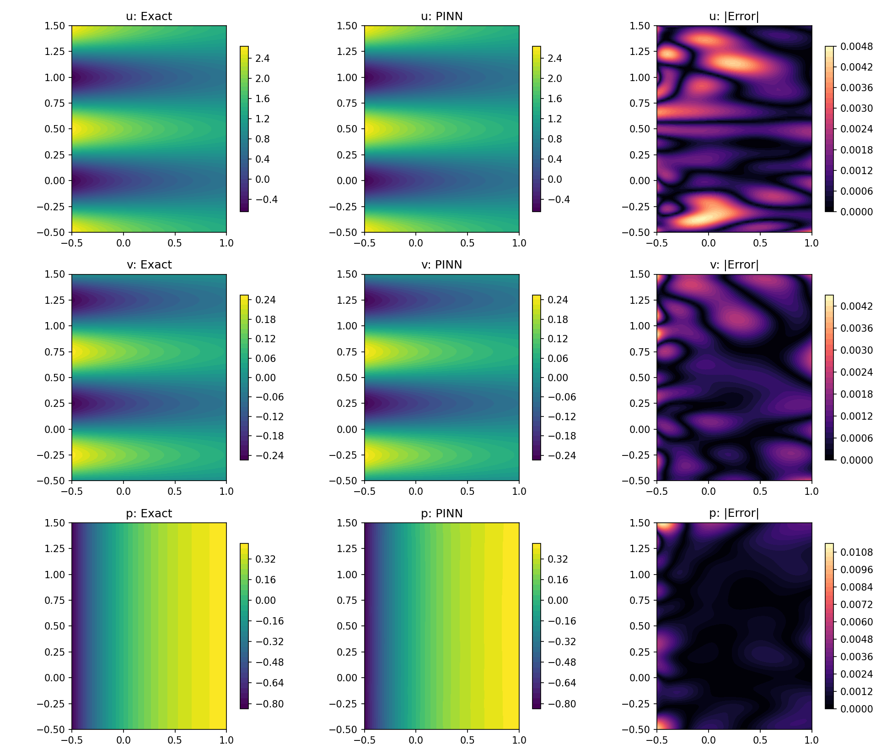
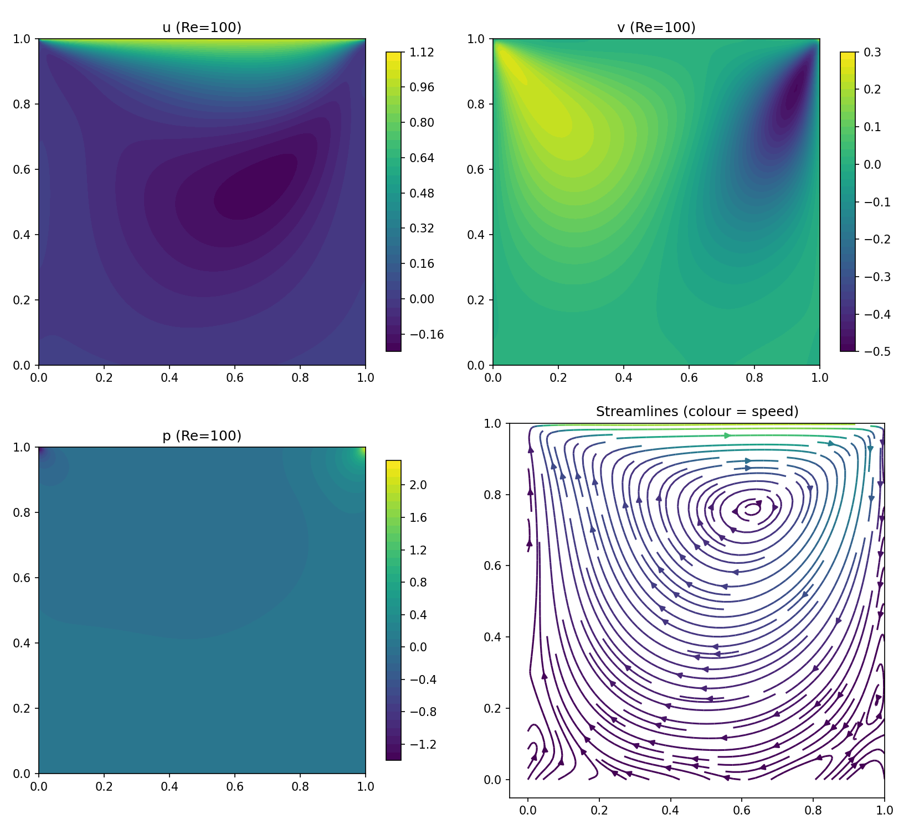
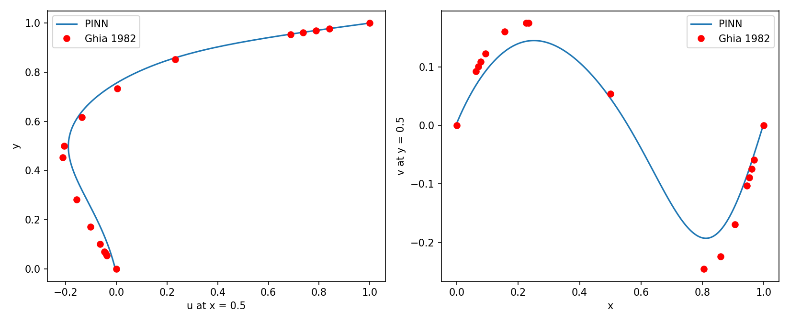
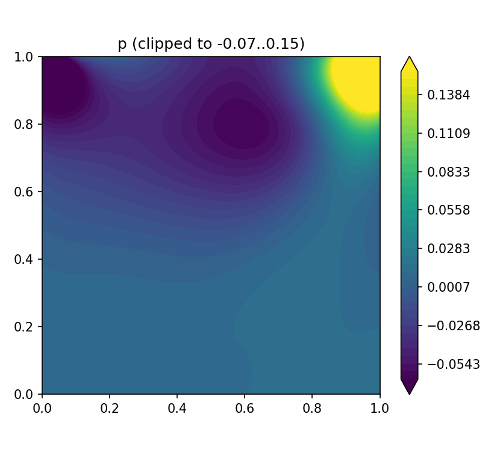

# Project 5: PINNs for 2D incompressible Navier-Stokes

Pure PyTorch physics-informed neural network (PINN) that predicts velocity (u, v) and pressure (p) from the steady 2D Navier-Stokes equations. Two cases:

1. **Kovasznay flow** (Re = 40): has an exact solution, so it validates the code.
2. **Lid-driven cavity** (Re = 100): validated against the Ghia et al. (1982) centerline tables.

## Physics

Steady, incompressible, nondimensional:

- Continuity: `u_x + v_y = 0`
- x-momentum: `u u_x + v u_y + p_x - (1/Re)(u_xx + u_yy) = 0`
- y-momentum: `u v_x + v v_y + p_y - (1/Re)(v_xx + v_yy) = 0`

## Method

- Network: `(x, y) -> (u, v, p)`, 6 hidden layers x 40 units, tanh, Xavier init (8443 parameters).
- All derivatives come from `torch.autograd.grad` with `create_graph=True`.
- Loss = `W_PDE * mean(residuals^2) + W_BC * mean((u,v - boundary)^2) + W_P * (pressure constraint)^2`.
- Pressure is defined only up to a constant, so it is fixed by one anchor point (Kovasznay) or by `mean(p)^2 = 0` (cavity).
- Optimizer: Adam (lr 1e-3, exponential decay) -> fresh Adam (lr 5e-4) -> L-BFGS in **float64**.
  - In float32, L-BFGS stopped after 1-2 iterations (line-search round-off). In float64 it ran all 500.

| | Kovasznay | Cavity |
|---|---|---|
| Domain | x in [-0.5, 1], y in [-0.5, 1.5] | [0, 1]^2 |
| Re | 40 | 100 |
| Interior points | 5000 | 10000 |
| Boundary points | 100 per edge | 200 per wall |
| Weights (PDE, BC, p) | (1, 10, 10) | (1, 10, 1) |
| Adam | 10k + 10k | 15k + 15k |
| L-BFGS (float64) | 500 iterations | 500 iterations |

## Results

### Kovasznay (validated against the exact solution)

| Field | Relative L2 error | Max abs error |
|---|---|---|
| u | 0.13% | 4.7e-3 |
| v | 0.95% | 4.4e-3 |
| p | 0.41% | 1.1e-2 |



### Lid-driven cavity (validated against Ghia et al. 1982, Re = 100)

| Centerline | Max error | RMS error |
|---|---|---|
| u at x = 0.5 | 0.040 | 0.022 |
| v at y = 0.5 | 0.053 | 0.027 |





## Known limitations (please read)

- **The cavity does not match Ghia closely.** The flow pattern is right (one primary vortex, corner eddies), and u is within about 2% RMS. But **v is systematically about 19% too weak** (median PINN/Ghia ratio 0.81 over the points where |Ghia v| > 0.05).
- **Lid corners.** The velocity jump (u = 1 next to u = 0) cannot be represented by a smooth tanh network. The PDE residual near the lid corners is about 6x the rest, and u overshoots to 1.10 at the top-left corner (about 0.02% of the grid). Pressure extremes (-1.35 to 2.23) also sit in the corners.
- **Tested, did not fix the weak vortex:**
  - lid under-driven (no: centre of lid is at u - 1 = -0.0001)
  - more optimization (L-BFGS cut the loss about 37%, Ghia error barely moved)
  - extra boundary and collocation points near the lid corners
  - lowering the boundary weight to 1 (PDE loss fell about 3x, Ghia error improved about 10%, v ratio unchanged at 0.81)
- **Not tested:** larger network, more interior points, a smoothed lid profile, a different seed, other Re.
- Single seed. The cavity result has not been reproduced by a full rerun from scratch.
- Pressure in the cavity is unvalidated (Ghia gives velocity only).

## Run it

Run the notebook top to bottom in Colab (GPU). `ns_residual` reads the global `RE`, so set `RE` before calling it. Saved weights:

```
weights/pinn_kovasznay_final.pt
weights/pinn_cavity_final.pt
```

## Reference

Ghia, U., Ghia, K. N., Shin, C. T. (1982). High-Re solutions for incompressible flow using the Navier-Stokes equations and a multigrid method. J. Comput. Phys. 48, 387-411.
